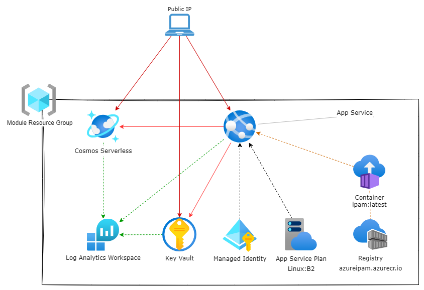

# Default example

This example deploys the module in its simplest form
>It is not recommended for production use.

It will deploy the IPAM as a publicly exposed WebApp with the UI disabled.

>For an functional deployment, replace `engine_app_id` and `engine_secret` with actual App registration details. 

