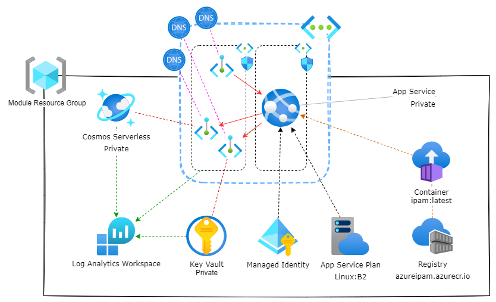

# Private example

This example deploys the module with private access via private endpoints.

>Well not entirely private, the keyvault needs to be public for the terraform runner to set/update the secrets for this example. In production the terraform runner would need access to the vault via the pep and the public access would be disabled.

It will deploy the IPAM as a private WebApp with the UI disabled. 

>For an functional deployment, replace `engine_app_id` and `engine_secret` with actual App registration details. 

