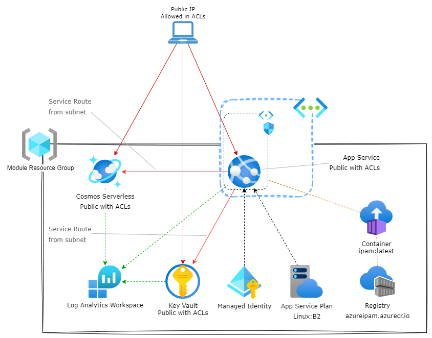

<!-- BEGIN_TF_DOCS -->
# Public Service but with Network ACLs example

This example deploys the module with public access for the services locked down with IP addresses and service routes.

It will deploy the IPAM as a publicly exposed WebApp with the UI enabled.

>For an functional deployment, replace `engine_app_id`, `engine_secret` and `ui_app_id` with actual App registration details.

>The example uses 0.0.0.0/0 (or equivalent) in the IP ACLs as a source IP cannot be predicted. You should replace this with a set of IP addresses that are relevant to your scenario.

>You will need to update the ***Redirect URIs*** of the UI App registration with the URL of the WebApp before you can authenticate



```hcl
terraform {
  required_version = "~> 1.7"
  required_providers {
    azurerm = {
      source  = "hashicorp/azurerm"
      version = "~> 3.98"
    }
    http = {
      source  = "hashicorp/http"
      version = "~> 3.4"
    }
    random = {
      source  = "hashicorp/random"
      version = "~> 3.6"
    }
  }
}

provider "azurerm" {
  features {
    resource_group {
      prevent_deletion_if_contains_resources = false
    }
  }
}

resource "random_string" "name" {
  length  = 6
  numeric = false
  special = false
  upper   = false
}

## Section to provide a random Azure region for the resource group
# This allows us to randomize the region for the resource group.
module "regions" {
  source  = "Azure/regions/azurerm"
  version = "~> 0.3"
}

# This allows us to randomize the region for the resource group.
resource "random_integer" "region_index" {
  max = length(module.regions.regions) - 1
  min = 0
}
## End of section to provide a random Azure region for the resource group

data "http" "terraform_runner_public_ip" {
  url = "https://ifconfig.co/json"
  request_headers = {
    Accept = "application/json"
  }
}


resource "azurerm_resource_group" "network" {
  location = module.regions.regions[random_integer.region_index.result].name
  name     = "rg-${random_string.name.result}-02"
}

resource "azurerm_network_security_group" "network" {
  location            = azurerm_resource_group.network.location
  name                = "nsg-${random_string.name.result}-01"
  resource_group_name = azurerm_resource_group.network.name
}

resource "azurerm_virtual_network" "network" {
  address_space       = ["192.168.0.0/24"]
  location            = azurerm_resource_group.network.location
  name                = "vnet-${random_string.name.result}"
  resource_group_name = azurerm_resource_group.network.name
}

resource "azurerm_subnet" "webapp" {
  address_prefixes     = ["192.168.0.0/25"]
  name                 = "webapp"
  resource_group_name  = azurerm_resource_group.network.name
  virtual_network_name = azurerm_virtual_network.network.name
  service_endpoints    = ["Microsoft.KeyVault", "Microsoft.AzureCosmosDB"]

  delegation {
    name = "webapps"

    service_delegation {
      name    = "Microsoft.Web/serverFarms"
      actions = ["Microsoft.Network/virtualNetworks/subnets/action"]
    }
  }
}

resource "azurerm_subnet_network_security_group_association" "webapp" {
  network_security_group_id = azurerm_network_security_group.network.id
  subnet_id                 = azurerm_subnet.webapp.id
}

locals {
  runner_ip = "${jsondecode(data.http.terraform_runner_public_ip.response_body).ip}/32"
}

module "public_with_acls" {
  source = "../../"
  # Mandatory resource attributes
  engine_app_id = "00000000-0000-0000-0000-000000000000"
  engine_secret = "super-secret-secret"
  location      = module.regions.regions[random_integer.region_index.result].name
  name          = random_string.name.result

  # Optional resource attributes
  ui_app_id = "00000000-0000-0000-0000-000000000000"
  virtual_network_integration = {
    subnet_id = azurerm_subnet.webapp.id
    nsg = {
      name                  = azurerm_network_security_group.network.name
      resource_group_name   = azurerm_network_security_group.network.resource_group_name
      starting_priority     = 1100
      subnet_address_prefix = azurerm_subnet.webapp.address_prefixes[0]
    }
  }
  public_access_keyvault = {
    ip_rules                   = [local.runner_ip]
    virtual_network_subnet_ids = [azurerm_subnet.webapp.id]
  }
  public_access_cosmos = {
    ip_rules                   = [local.runner_ip]
    virtual_network_subnet_ids = [azurerm_subnet.webapp.id]
  }
  public_access_webapp = {
    rules = {
      terraform_runner = {
        ip_address = local.runner_ip
        priority   = 100
      }
    }
  }
}
```

<!-- markdownlint-disable MD033 -->
## Requirements

The following requirements are needed by this module:

- <a name="requirement_terraform"></a> [terraform](#requirement\_terraform) (~> 1.7)

- <a name="requirement_azurerm"></a> [azurerm](#requirement\_azurerm) (~> 3.98)

- <a name="requirement_http"></a> [http](#requirement\_http) (~> 3.4)

- <a name="requirement_random"></a> [random](#requirement\_random) (~> 3.6)

## Providers

The following providers are used by this module:

- <a name="provider_azurerm"></a> [azurerm](#provider\_azurerm) (~> 3.98)

- <a name="provider_http"></a> [http](#provider\_http) (~> 3.4)

- <a name="provider_random"></a> [random](#provider\_random) (~> 3.6)

## Resources

The following resources are used by this module:

- [azurerm_network_security_group.network](https://registry.terraform.io/providers/hashicorp/azurerm/latest/docs/resources/network_security_group) (resource)
- [azurerm_resource_group.network](https://registry.terraform.io/providers/hashicorp/azurerm/latest/docs/resources/resource_group) (resource)
- [azurerm_subnet.webapp](https://registry.terraform.io/providers/hashicorp/azurerm/latest/docs/resources/subnet) (resource)
- [azurerm_subnet_network_security_group_association.webapp](https://registry.terraform.io/providers/hashicorp/azurerm/latest/docs/resources/subnet_network_security_group_association) (resource)
- [azurerm_virtual_network.network](https://registry.terraform.io/providers/hashicorp/azurerm/latest/docs/resources/virtual_network) (resource)
- [random_integer.region_index](https://registry.terraform.io/providers/hashicorp/random/latest/docs/resources/integer) (resource)
- [random_string.name](https://registry.terraform.io/providers/hashicorp/random/latest/docs/resources/string) (resource)
- [http_http.terraform_runner_public_ip](https://registry.terraform.io/providers/hashicorp/http/latest/docs/data-sources/http) (data source)

<!-- markdownlint-disable MD013 -->
## Required Inputs

No required inputs.

## Optional Inputs

No optional inputs.

## Outputs

The following outputs are exported:

### <a name="output_url"></a> [url](#output\_url)

Description: URL for the Azure IPAM service

## Modules

The following Modules are called:

### <a name="module_public_with_acls"></a> [public\_with\_acls](#module\_public\_with\_acls)

Source: ../../

Version:

### <a name="module_regions"></a> [regions](#module\_regions)

Source: Azure/regions/azurerm

Version: ~> 0.3

<!-- markdownlint-disable-next-line MD041 -->
## Data Collection

The software may collect information about you and your use of the software and send it to Microsoft. Microsoft may use this information to provide services and improve our products and services. You may turn off the telemetry as described in the repository. There are also some features in the software that may enable you and Microsoft to collect data from users of your applications. If you use these features, you must comply with applicable law, including providing appropriate notices to users of your applications together with a copy of Microsoft’s privacy statement. Our privacy statement is located at <https://go.microsoft.com/fwlink/?LinkID=824704>. You can learn more about data collection and use in the help documentation and our privacy statement. Your use of the software operates as your consent to these practices.
<!-- END_TF_DOCS -->