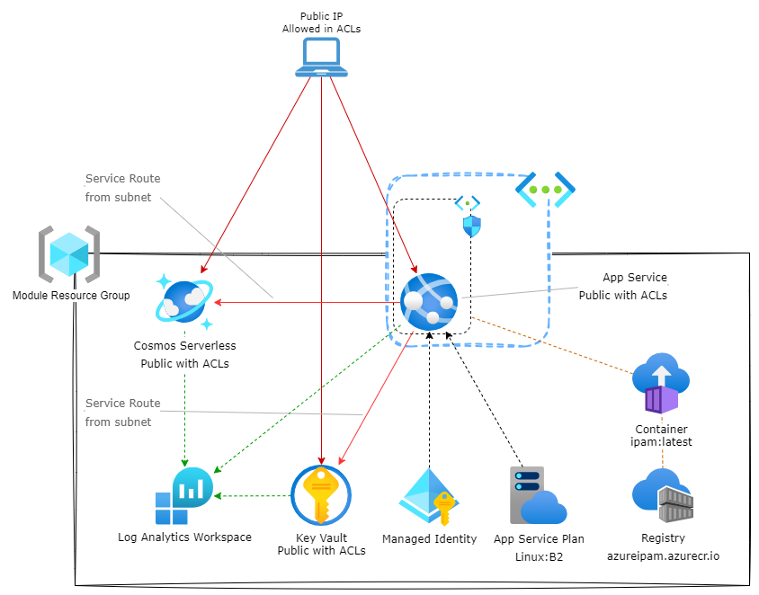

# Public Service but with Network ACLs example

This example deploys the module with public access for the services locked down with IP addresses and service routes.

It will deploy the IPAM as a publicly exposed WebApp with the UI enabled.

>For an functional deployment, replace `engine_app_id`, `engine_secret` and `ui_app_id` with actual App registration details. 

>The example uses 0.0.0.0/0 (or equivalent) in the IP ACLs as a source IP cannot be predicted. You should replace this with a set of IP addresses that are relevant to your scenario.

>You will need to update the ***Redirect URIs*** of the UI App registration with the URL of the WebApp before you can authenticate

